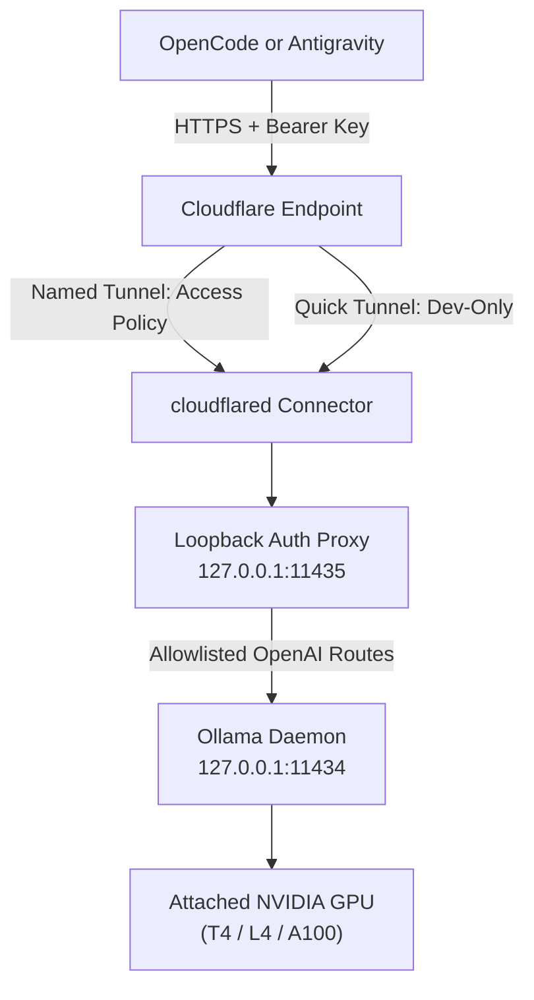

# Colab Ollama Bridge (`colab-ollama-bridge`)

[](https://github.com/Vidoxlabs/colab-ollama-bridge/actions/workflows/validate.yml)
[](https://opensource.org/licenses/MIT)
[](SECURITY.md)
[](https://colab.research.google.com/github/Vidoxlabs/colab-ollama-bridge/blob/main/notebooks/colab_ollama.ipynb)

**Colab Ollama Bridge** securely exposes an authenticated, OpenAI-compatible Ollama endpoint running on a Google Colab GPU runtime or a user-controlled Linux GPU host through Cloudflare Tunnel. It enables AI coding clients like OpenCode and Antigravity to perform chat, completion, and tool-call inference against attached NVIDIA GPUs without ever exposing Ollama directly to the public internet.

> [!WARNING]
> **Ephemeral Runtime Warning**:
> Google Colab runtimes are interactive, quota-limited, and ephemeral; sessions terminate on idle timeouts (~90 minutes) or maximum runtime limits (12 hours). Quick Tunnels (`*.trycloudflare.com`) provide no uptime SLA and are strictly for development and testing.

---

## Architecture



### Core Security Invariants
- **Loopback Origin**: Ollama binds exclusively to loopback (`127.0.0.1:11434`).
- **Mandatory Authentication**: All public and tunneled traffic must route through the loopback proxy (`127.0.0.1:11435`) which enforces `BRIDGE_API_KEY` using constant-time comparison.
- **Route Allowlist**: Exposes only OpenAI-compatible inference routes (`/v1/models`, `/v1/chat/completions`, `/v1/completions`, `/v1/embeddings`). Native Ollama administrative routes (`/api/*`) are blocked.
- **Zero Committed Secrets**: Credentials live in environment variables or mode `0600` files and are never displayed in logs, notebook outputs, or generated client configurations.

---

## Quick Starts

### Option A: Google Colab (Interactive)

1. Click [](https://colab.research.google.com/github/Vidoxlabs/colab-ollama-bridge/blob/main/notebooks/colab_ollama.ipynb).
2. Ensure an accelerator is active: **Runtime > Change runtime type > T4 / L4 / A100 GPU**.
3. (Recommended) Set `BRIDGE_API_KEY` in Colab Secrets (the key icon in the left sidebar).
4. Run all cells sequentially. The notebook will automatically pull the optimal model for your GPU and display your sanitized OpenCode configuration snippet.

### Option B: Headless Linux GPU Host

Run the pinned bootstrap entry point:

```bash
curl -fsSL https://raw.githubusercontent.com/Vidoxlabs/colab-ollama-bridge/v0.1.1/scripts/bootstrap.sh | \
  BRIDGE_API_KEY="your-secure-bridge-api-key-here" \
  bash
```

Or clone and run locally:

```bash
git clone https://github.com/Vidoxlabs/colab-ollama-bridge.git
cd colab-ollama-bridge
export BRIDGE_API_KEY="your-secure-bridge-api-key-here"
bash scripts/bootstrap.sh
```

---

## Hardware Detection & Model Matrix

The bootstrap script detects your attached NVIDIA GPU via `nvidia-smi` and queries `config/model-profiles.json` to select the conservative coding profile:

| Detected VRAM | Typical Colab GPU | Default Model Tag | Context Window | Rationale |
| :--- | :--- | :--- | :--- | :--- |
| `>= 36 GiB` | A100 40 GB | `qwen2.5-coder:32b` | 16,384 | High-quality coding model with usable KV-cache headroom |
| `>= 20 GiB` | L4 24 GB | `qwen2.5-coder:14b` | 16,384 | Avoids 32B weight pressure and partial CPU offload |
| `>= 12 GiB` | T4 16 GB | `qwen2.5-coder:7b` | 16,384 | Fits comfortably for responsive interactive coding |
| `< 12 GiB` | Fallback / Other | `qwen2.5-coder:3b` | 8,192 | Best-effort fallback for resource-constrained GPUs |

### Manual Overrides
To override defaults, set these environment variables before running the bootstrap:
- `MODEL_OVERRIDE="qwen2.5-coder:14b"`
- `OLLAMA_CONTEXT_LENGTH="8192"`

---

## Client Configuration (OpenCode)

### 1. Quick Tunnel (Development)

Export the endpoint and key in your local shell profile:
```bash
export COLAB_OLLAMA_BASE_URL="https://your-tunnel.trycloudflare.com"
export COLAB_BRIDGE_API_KEY="your-bridge-api-key"
```

Add the provider to `~/.config/opencode/opencode.json`:
```jsonc
{
  "$schema": "https://opencode.ai/config.json",
  "provider": {
    "colab-ollama": {
      "npm": "@ai-sdk/openai-compatible",
      "name": "Colab Ollama Bridge",
      "options": {
        "baseURL": "{env:COLAB_OLLAMA_BASE_URL}/v1",
        "apiKey": "{env:COLAB_BRIDGE_API_KEY}"
      },
      "models": {
        "qwen2.5-coder:7b": {
          "name": "Qwen 2.5 Coder 7B (Colab)",
          "limit": {
            "context": 16384,
            "output": 8192
          }
        }
      }
    }
  }
}
```

### 2. Named Tunnel with Cloudflare Access (Hardened)

Export Access Service Token credentials alongside the bridge key:
```bash
export COLAB_OLLAMA_BASE_URL="https://ollama.yourdomain.com"
export COLAB_BRIDGE_API_KEY="your-bridge-api-key"
export CF_ACCESS_CLIENT_ID="your-access-client-id"
export CF_ACCESS_CLIENT_SECRET="your-access-client-secret"
```

Configure OpenCode:
```jsonc
{
  "$schema": "https://opencode.ai/config.json",
  "provider": {
    "colab-ollama": {
      "npm": "@ai-sdk/openai-compatible",
      "name": "Colab Ollama Bridge",
      "options": {
        "baseURL": "{env:COLAB_OLLAMA_BASE_URL}/v1",
        "apiKey": "{env:COLAB_BRIDGE_API_KEY}",
        "headers": {
          "CF-Access-Client-Id": "{env:CF_ACCESS_CLIENT_ID}",
          "CF-Access-Client-Secret": "{env:CF_ACCESS_CLIENT_SECRET}"
        }
      },
      "models": {
        "qwen2.5-coder:14b": {
          "name": "Qwen 2.5 Coder 14B (Colab)",
          "limit": {
            "context": 16384,
            "output": 8192
          }
        }
      }
    }
  }
}
```

For full Access setup instructions, see [Cloudflare Access Guide](docs/cloudflare-access.md).

---

## Companion Google Colab MCP (Antigravity)

If you use an MCP-compatible coding agent (such as Antigravity) and wish to provide notebook execution control tools, you can optionally configure Google's official [googlecolab/colab-mcp](https://github.com/googlecolab/colab-mcp):

```json
{
  "mcpServers": {
    "colab": {
      "command": "uvx",
      "args": [
        "git+https://github.com/googlecolab/colab-mcp@main"
      ],
      "env": {}
    }
  }
}
```

> [!NOTE]
> **Decoupled Responsibilities**: The Colab MCP is an independent agent control channel. The inference provider functions completely without it, and failures in one do not indicate failures in the other.

---

## Verification & Local Development

Run the complete validation test suite locally:

```bash
make install
make check
```

For detailed troubleshooting, see [Troubleshooting Guide](docs/troubleshooting.md).

---

## Governance & Links

- [Architecture Design](docs/architecture.md)
- [Security Policy & Threat Model](docs/security.md)
- [Compatibility Matrix](docs/compatibility.md)
- [Publishing & Release Gate](docs/publishing.md)
- [Contributing Guide](CONTRIBUTING.md)
- [Code of Conduct](CODE_OF_CONDUCT.md)
- [License (MIT)](LICENSE)
