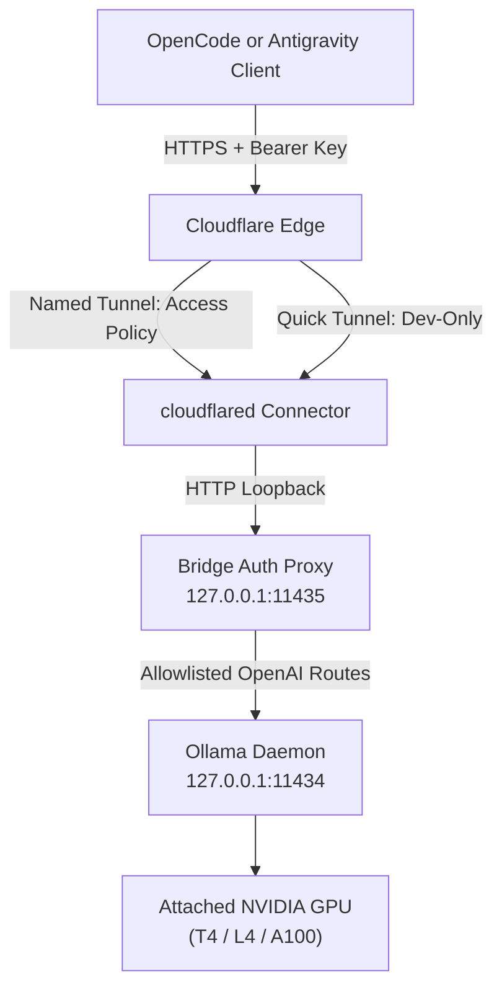
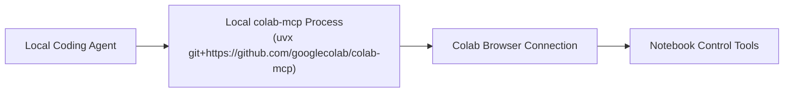

# Colab Ollama Bridge Architecture

`colab-ollama-bridge` turns an interactive Google Colab GPU runtime or a self-hosted Linux GPU host into an authenticated, OpenAI-compatible Ollama endpoint exposed via Cloudflare Tunnel.

---

## 1. System Overview

The Colab MCP integration operates on a separate, independent channel:

Failure or status of one path does not affect or report failure on the other.

---

## 2. Runtime Components

| Component | Bind Address | Primary Responsibility | Explicit Boundaries (Must NOT) |
| :--- | :--- | :--- | :--- |
| **Ollama** | `127.0.0.1:11434` | Model lifecycle management, weight loading, and OpenAI-compatible inference execution. | Must NOT listen on public interfaces (`0.0.0.0`) or handle client authentication. |
| **Auth Proxy** (`src/bridge_proxy.py`) | `127.0.0.1:11435` | Constant-time bearer key validation (`BRIDGE_API_KEY`), route allowlisting, payload capping (8 MiB), hop-by-hop header stripping, streaming SSE passthrough. | Must NOT log sensitive headers or payloads, return local stack traces, or expose Ollama administrative routes (`/api/*`). |
| **cloudflared** | Outbound daemon | Connects outbound TLS tunnel from Cloudflare edge to local proxy on `127.0.0.1:11435`. | Must NOT point directly to Ollama (`11434`) or accept credentials on command-line arguments. |
| **Supervisor** (`src/supervisor.py`) | Local daemon | Manages process lifecycles, health checks, bounded restart loops, and stops only owned PIDs. | Must NOT attempt to keep Colab alive or kill unrelated system PIDs. |
| **Notebook UI** (`colab_ollama.ipynb`) | Interactive cells | Resolves secrets in memory via Colab Secrets / `getpass`, executes shared bootstrap, displays sanitized configs. | Must NOT commit or display cell outputs containing credentials. |

---

## 3. Tunnel Modes & Security Posture

### Named Tunnel (Recommended Production Posture)
- **Selection**: Triggered only when `TUNNEL_TOKEN` or `TUNNEL_TOKEN_FILE` is supplied.
- **Execution**: Token is written to a temporary mode `0600` file and provided to cloudflared using `cloudflared tunnel run --token-file <path>`. The token is immediately purged from environment memory.
- **Access Policy**: Hardened behind Cloudflare Access Service Auth requiring `CF-Access-Client-Id` and `CF-Access-Client-Secret` headers.

### Quick Tunnel (Development & Evaluation Only)
- **Selection**: Used when no tunnel token is supplied.
- **Execution**: Runs `cloudflared tunnel --url http://127.0.0.1:11435`.
- **Posture**: Scrapes and reports the generated `*.trycloudflare.com` endpoint. The endpoint remains strictly protected by the origin bearer authentication proxy.
- **Notice**: Quick Tunnels provide no SLA and are explicitly development-only.

---

## 4. Request Lifecycle & Routing Policy

The bridge proxy strictly enforces the following route matrix:

| Method | Path | Auth Required | Action |
| :--- | :--- | :--- | :--- |
| `GET` | `/healthz` | No | Local bridge health check (`{"status": "healthy"}`). No upstream details. |
| `GET` | `/v1/models` | Yes | Authenticated model discovery; forwarded to Ollama. |
| `POST` | `/v1/chat/completions` | Yes | Authenticated chat / tool-call inference (streaming and non-streaming). |
| `POST` | `/v1/completions` | Yes | Authenticated text completion route. |
| `POST` | `/v1/embeddings` | Yes | Embeddings route (returns 404 unless `ENABLE_EMBEDDINGS=true`). |
| `*` | *All other routes* | - | Returns HTTP 404 (`{"error": {"code": "not_found"}}`). |

- **Header Stripping**: The proxy strips `connection`, `keep-alive`, `proxy-authenticate`, `proxy-authorization`, `te`, `trailers`, `transfer-encoding`, `upgrade`, and suppresses `Authorization` before forwarding to Ollama.
- **Payload Cap**: Request bodies exceeding 8 MiB return HTTP 413 Payload Too Large.
- **Streaming**: Server-Sent Events (`text/event-stream`) are streamed directly chunk-by-chunk without whole-response buffering.

---

## 5. Trust Boundaries

1. **Repository Boundary**: Everything committed is assumed public. No secrets, private IPs, or captured outputs are ever tracked.
2. **Notebook Boundary**: Outputs are stripped. Credentials remain in runtime memory or mode `0600` temporary files.
3. **Edge Boundary**: The tunnel provides network reachability, not authorization. Bearer validation is mandatory in both modes.
4. **Origin Boundary**: Ollama binds exclusively to loopback `127.0.0.1`.
