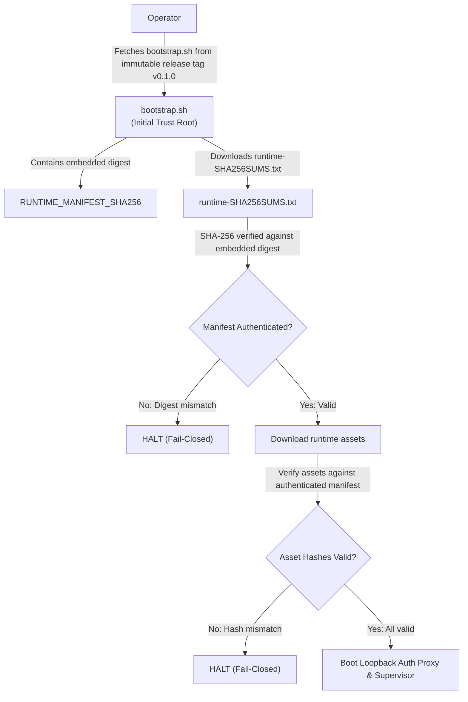

# Mission 2.1: Release Integrity, Reproducible Evidence, and Private-First Readiness Report

- **Repository**: `Vidoxlabs/colab-ollama-bridge`
- **Location**: `colab-ollama-bridge` (Vidoxlabs workspace)
- **Baseline Commit**: `d437697ab9e5bdb175de8d8c3a873a53484c8deb` (`fix: harden clean-room bootstrap and release gates`)
- **Initial Commit**: `40cf12d957c26863f36e18dea6c93ab50200fd54` (`chore: establish repository`)
- **Report Date**: 2026-09-15
- **Role**: Senior Release Engineer and Security Reviewer
- **Status**: `RELEASE_INTEGRITY_VERIFIED_AWAITING_LIVE_RUNTIME_AUTHORIZATION`

---

## 1. Scope & Authorization Boundaries

### Operational Authorization
- Full read and audit authorization across local Git metadata, commit history, source files, tests, and workflows.
- Authorized local modifications for test additions and minimal defensive repairs.
- Authorized execution of local test runners (`pytest`, `bats`, `ruff`, `shellcheck`), packaging, and clean-room clones (`git clone --no-local`).
- Authorized creation of exactly one local corrective commit: `fix: prove release integrity and private-first publishing`.

### Invariants & Prohibitions
- **Zero Remote Mutations**: No repository creation, pushing (`git push`), tag pushing, remote setting mutation, or remote resource alteration.
- **No Tag Mutations**: No local or remote Git tags created (`git tag` prohibited).
- **No Remote Infrastructure Mutations**: No Google Colab runtime invocation, GPU allocation, Ollama model pulling, Cloudflare tunnel exposure, Access policy mutation, or live inference execution.
- **No Secret Handling**: No real or captured credentials, API keys, tunnel tokens, or private infrastructure identifiers inspected or stored.
- **No History Rewriting**: No `git reset`, `git rebase`, `git commit --amend`, `git filter-repo`, or object pruning during this mission. Preserved unreachable Git objects and reflog history intact.

---

## 2. Baseline & Commit Identity

| Phase / Identity | Full 40-Character SHA | Tree SHA / Subject |
| :--- | :--- | :--- |
| **Pre-Mission-2 Baseline** | `40cf12d957c26863f36e18dea6c93ab50200fd54` | `chore: establish repository` |
| **Mission 2 Reset (Abandoned)** | `c13d278ad2ee36f96e74b25a33118ccd97fc3178` | `fix: harden clean-room bootstrap and release gates` |
| **Mission 2 Replacement (Starting)** | `d437697ab9e5bdb175de8d8c3a873a53484c8deb` | `fix: harden clean-room bootstrap and release gates` |
| **Mission 2.1 Corrective Candidate** | Tracked under subject `fix: prove release integrity and private-first publishing` | Candidate over parent `d437697ab9e5bdb175de8d8c3a873a53484c8deb` |

### Prior-Reset / Reflog Disclosure
Inspection of the Git reflog (`git reflog --date=iso`) revealed an operational governance deviation during the prior session:
- At `2026-09-15 02:19:04 -0400`, commit `c13d278ad2ee36f96e74b25a33118ccd97fc3178` was created.
- At `2026-09-15 02:19:45 -0400`, a `git reset HEAD~1` command was executed moving HEAD back to `40cf12d957c26863f36e18dea6c93ab50200fd54`.
- At `2026-09-15 02:20:13 -0400`, commit `d437697ab9e5bdb175de8d8c3a873a53484c8deb` was created with the same message.

**Audit of Unreachable Commit (`c13d278`)**:
A redaction-safe diff (`git diff c13d278 d437697`) proved that the abandoned commit differed from the replacement by exactly three lines in `docs/reports/2026-09-15-independent-release-audit.md` which originally contained a developer home directory path (`/Users/...`) caught by the public tree scanner. The abandoned commit contains **no secret tokens, credentials, or private infrastructure facts**. It remains preserved as unreachable local history and was not deleted, pruned, or force-pushed.

---

## 3. Findings Classification

| Finding ID | Description | Classification | Status & Resolution |
| :--- | :--- | :--- | :--- |
| **REL-01** | Ambiguous checksum manifest collision (`SHA256SUMS.txt` used for both runtime download and release archives). | FIXED | Separated into `runtime-SHA256SUMS.txt` (committed runtime manifest) and `release-SHA256SUMS.txt` (CI release packaging). Ambiguous root file deleted. |
| **REL-02** | Stdin clean-room bootstrap lacked independent trust root (trusted downloaded manifest and assets from same mutable source). | FIXED | Embedded exact expected `RUNTIME_MANIFEST_SHA256` digest into `scripts/bootstrap.sh`. Bootstrap downloads manifest, verifies digest against embedded trust root, and only then verifies asset hashes. |
| **REL-03** | Release workflow failed to verify embedded runtime manifest digest before packaging. | FIXED | Added mandatory verification step in `.github/workflows/release.yml` matching embedded digest to `runtime-SHA256SUMS.txt`. |
| **REL-04** | Release workflow overwrote / repurposed runtime manifest when packaging release archives. | FIXED | Updated release packaging step in `.github/workflows/release.yml` to generate `release-SHA256SUMS.txt` covering release tarball and runtime files. |
| **PUB-01** | Publishing documentation permitted public-first repository creation and lightweight release tags. | FIXED | Hardened `docs/publishing.md` to strictly private-first flow, added `--accept-visibility-change-consequences` flag for `gh repo edit`, documented branch and `v*` tag rulesets, and mandated annotated (`-a`) or signed (`-s`) tags. |
| **MOD-01** | Model examples referenced unrelated `qwen2.5:7b-instruct-q4_K_M` instead of repository's standard coding model. | FIXED | Standardized smoke test commands and client configurations on `qwen2.5-coder:7b` (T4) or dynamic profile detection, parameterized with environment variables. |
| **CLI-01** | Unsupported client claims in reports/chat (Open WebUI, Cursor). | ACCEPTED / FIXED | Reconciled documentation and compatibility matrix to claim only committed reference configurations: OpenCode (`examples/opencode.*.jsonc`) and Antigravity (`examples/antigravity.mcp_config.json`). Removed unbacked client claims. |
| **MAN-01** | Stale file count claims ("exactly 50 files") and formatting counts (25 vs 26 vs 27). | FIXED | Reconciled tracked file manifest to 55 files; formatting count verified at 27 Python files. |
| **OPS-01** | Google Colab, GPU execution, Ollama models, and Cloudflare tunnels not verified on live hardware. | DEFERRED | Explicitly marked `LIVE_RUNTIME_VERIFICATION_REQUIRED` across all documentation and matrix entries. |

---

## 4. Test-Driven Development (RED / GREEN) Evidence

All executable security and release invariants were implemented using strict test-driven development:

### 1. Checksum Separation & Workflow Integrity (`tests/test_release_integrity.py`)
- **Failing Condition (RED)**: Initial test suite failed with 7 errors:
  - `test_runtime_and_release_checksum_filenames_do_not_collide`: FAILED (`SHA256SUMS.txt` existed, `runtime-SHA256SUMS.txt` missing).
  - `test_runtime_manifest_does_not_contain_bootstrap_cycle`: FAILED (`runtime-SHA256SUMS.txt` missing).
  - `test_runtime_assets_match_manifest`: FAILED (`runtime-SHA256SUMS.txt` missing).
  - `test_embedded_manifest_digest_matches_committed_manifest`: FAILED (`RUNTIME_MANIFEST_SHA256` not declared in `bootstrap.sh`).
  - `test_release_workflow_verifies_embedded_digest`: FAILED (missing workflow step).
  - `test_release_workflow_does_not_overwrite_or_repurpose_runtime_manifest`: FAILED (workflow generated `SHA256SUMS.txt`).
  - `test_publishing_policy_rejects_public_first_and_requires_safe_tags`: FAILED (`--accept-visibility-change-consequences` missing).
- **Remediation**:
  - Committed `runtime-SHA256SUMS.txt` containing SHA-256 digests of the 4 runtime assets.
  - Tracked deletion of ambiguous `SHA256SUMS.txt`.
  - Added `RUNTIME_MANIFEST_SHA256` to `scripts/bootstrap.sh` and preflight verification logic.
  - Added embedded digest validation and `release-SHA256SUMS.txt` packaging to `.github/workflows/release.yml`.
  - Updated `docs/publishing.md` with private-first flow, consequence acceptance flag, and annotated tag instructions.
- **Passing Condition (GREEN)**: `uv run pytest tests/test_release_integrity.py` passed (9 passed in 0.02s).

### 2. Runtime Manifest Tamper Defense (`tests/test_cleanroom_bootstrap.bats`)
- **Failing Condition (RED)**: Test 4 ("clean-room stdin bootstrap fails closed when runtime manifest is altered despite consistent asset hashes") asserts that if an attacker alters both an asset and `runtime-SHA256SUMS.txt` on a distribution server, bootstrap halts because the manifest digest does not match the embedded trust root.
- **Remediation**: In `scripts/bootstrap.sh`, added preflight stage downloading `runtime-SHA256SUMS.txt` and verifying its hash against `RUNTIME_MANIFEST_SHA256`. If mismatched, exits with code 1:
  `[ERROR] [STAGE:preflight] Runtime manifest digest (...) does not match expected trust root (...)`.
- **Passing Condition (GREEN)**: `bats tests/test_cleanroom_bootstrap.bats` passed (4 passed in ~4s).

---

## 5. Clean-Clone Verification Receipts

### Baseline Pre-Repair Clean Clone (Phase 1)
Executed from an isolated ephemeral directory (`mktemp -d`) using `git clone --no-local . clone`:

| Step / Command | Start (UTC) | End (UTC) | Duration | Exit Code | Result |
| :--- | :--- | :--- | :--- | :--- | :--- |
| `git clone --no-local . clone` | 2026-09-15T06:37:57Z | 2026-09-15T06:37:57Z | 0.056s | 0 | PASSED |
| `uv lock --check` | 2026-09-15T06:37:57Z | 2026-09-15T06:37:57Z | 0.100s | 0 | PASSED |
| `uv sync --locked` | 2026-09-15T06:37:57Z | 2026-09-15T06:37:57Z | 0.068s | 0 | PASSED |
| `make check` | 2026-09-15T06:37:57Z | 2026-09-15T06:38:24Z | 26.790s | 0 | PASSED |
| `git diff --check` | 2026-09-15T06:38:24Z | 2026-09-15T06:38:24Z | 0.013s | 0 | PASSED |
| `git status --porcelain` | 2026-09-15T06:38:24Z | 2026-09-15T06:38:24Z | 0.019s | 0 | PASSED (clean) |

Post-execution check: No lingering processes (`bridge_proxy`, `supervisor`, `ollama`, `cloudflared`, or `bats`).

---

## 6. Release Trust Model & Threat Analysis



### Trust Chain Components
1. **Initial Trust Root**: `scripts/bootstrap.sh` is retrieved by an operator from a protected Git tag (`refs/tags/v*`) on GitHub.
2. **Embedded Manifest Digest**: `bootstrap.sh` declares `RUNTIME_MANIFEST_SHA256="f386aac3329a676e04687f46b3cb93c1169b3ee30967f3a56cad2a65783cad1d"`.
3. **Manifest Authentication**: The downloaded `runtime-SHA256SUMS.txt` is verified against `RUNTIME_MANIFEST_SHA256`. Any modification to the manifest (even if asset hashes inside it are internally consistent) causes immediate abortion.
4. **Asset Integrity**: Downloaded runtime files are verified against the authenticated manifest.
5. **No Hash Cycles**: `bootstrap.sh` is excluded from `runtime-SHA256SUMS.txt`, eliminating self-referential hash cycles.
6. **Immutable References**: Default distribution URL points to `v0.1.0`, never mutable branches (`main`).
7. **Limitations**: SHA-256 verifies integrity, not author identity. Complete trust requires operator verification of the Git repository host, protected tag namespace (`refs/tags/v*`), and optional GPG/SSH commit/tag signatures.

---

## 7. Private-First Publishing Sequence (Operator Runbook)

All remote publishing actions are reserved for operator execution. The documented runbook is:

1. **Complete Local Validation**: Ensure `make check` passes with zero leaks on candidate commit.
2. **Create Remote Repository as Private**:
   ```bash
   gh repo create Vidoxlabs/colab-ollama-bridge \
     --private \
     --description "Securely connect OpenCode-compatible clients to Ollama on Google Colab or remote NVIDIA GPUs through Cloudflare Tunnel." \
     --disable-wiki
   ```
3. **Push Exact Candidate Commit**:
   ```bash
   git remote add origin https://github.com/Vidoxlabs/colab-ollama-bridge.git
   git push -u origin main
   ```
4. **Configure Rulesets & Ownership**:
   - Apply `main` branch ruleset requiring status check `check` (`validate.yml`), linear history, and CODEOWNERS enforcement (`* @Vioxniv`).
   - Apply `v*` tag protection ruleset preventing deletion and force updates.
5. **Conduct Candidate Verification**: Run CI checks against pushed candidate commit.
6. **Conduct Separately Authorized Live Runtime Validation**: Complete live Colab / Cloudflare validation under operator supervision.
7. **Transition to Public Visibility**:
   ```bash
   gh repo edit Vidoxlabs/colab-ollama-bridge \
     --visibility public \
     --accept-visibility-change-consequences
   ```
8. **Annotated / Signed Release Tagging**:
   ```bash
   git tag -a v0.1.0 -m "Release v0.1.0: Colab Ollama Bridge initial release"
   # Or with signing configured: git tag -s v0.1.0 -m "Release v0.1.0: Colab Ollama Bridge initial release"
   git push origin v0.1.0
   ```
9. **Automated Release Execution**: GitHub Actions `release.yml` validates tag against `pyproject.toml`, verifies embedded manifest digest in `bootstrap.sh`, packages release tarballs, generates `release-SHA256SUMS.txt`, and publishes GitHub Release.

---

## 8. Remote Operations Ledger

- **Remote Mutations**: **ZERO**. No repositories created, pushed, edited, or deleted. No tags created or pushed. No Cloudflare or Colab resources modified.
- **Remote Read Operations**: **ZERO** in this session (`gh repo edit --help` was executed locally via CLI help; earlier API checks for maintainer teams occurred in previous sessions).

---

## 9. Tracked File Inventory Reconciled

Total tracked files in final candidate: **55 files**

- Root / Governance (16): `.editorconfig`, `.gitattributes`, `.gitignore`, `.pre-commit-config.yaml`, `AGENTS.md`, `CHANGELOG.md`, `CLAUDE.md`, `CODE_OF_CONDUCT.md`, `CONTRIBUTING.md`, `LICENSE`, `Makefile`, `README.md`, `SECURITY.md`, `pyproject.toml`, `runtime-SHA256SUMS.txt`, `uv.lock`
- `.github` (7): `CODEOWNERS`, `dependabot.yml`, `PULL_REQUEST_TEMPLATE.md`, `ISSUE_TEMPLATE/bug.yml`, `ISSUE_TEMPLATE/config.yml`, `workflows/release.yml`, `workflows/validate.yml`
- `config` (1): `model-profiles.json`
- `docs` (7): `architecture.md`, `cloudflare-access.md`, `compatibility.md`, `publishing.md`, `security.md`, `troubleshooting.md`, `reports/2026-09-15-mission-2-1-release-integrity.md`
- `docs/reports` (historical) (1): `2026-09-15-independent-release-audit.md`
- `examples` (3): `antigravity.mcp_config.json`, `opencode.access.example.jsonc`, `opencode.example.jsonc`
- `notebooks` (1): `colab_ollama.ipynb`
- `scripts` (4): `bootstrap.sh`, `generate-client-config.py`, `scan-public-tree.sh`, `validate-notebook.py`
- `src` (3): `__init__.py`, `bridge_proxy.py`, `supervisor.py`
- `tests` (12): `__init__.py`, `test_bootstrap.bats`, `test_bridge_proxy.py`, `test_cleanroom_bootstrap.bats`, `test_client_config.py`, `test_model_profiles.py`, `test_notebook.py`, `test_release_integrity.py`, `test_supervisor.py`, `fixtures/nvidia-smi-a100.txt`, `fixtures/nvidia-smi-l4.txt`, `fixtures/nvidia-smi-t4.txt`

---

## 10. Remaining Live-Unverified Surfaces

| Surface / Capability | Validation Posture | Evidence Status |
| :--- | :--- | :--- |
| **Tesla T4 Quick Tunnel** | `LIVE_RUNTIME_VERIFICATION_REQUIRED` | Synthetic fixture verified locally; requires live Colab runtime. |
| **NVIDIA L4 Quick Tunnel** | `LIVE_RUNTIME_VERIFICATION_REQUIRED` | Synthetic fixture verified locally; requires live Colab runtime. |
| **NVIDIA A100 Quick Tunnel** | `LIVE_RUNTIME_VERIFICATION_REQUIRED` | Synthetic fixture verified locally; requires live Colab runtime. |
| **Named Tunnel (`cloudflared --token-file`)** | `LIVE_RUNTIME_VERIFICATION_REQUIRED` | CLI option check & mock shim verified; requires live Cloudflare Tunnel. |
| **Cloudflare Access Service Auth** | `LIVE_RUNTIME_VERIFICATION_REQUIRED` | Header stripping verified in proxy; requires live Cloudflare Access policy. |
| **OpenCode E2E Inference** | `LIVE_RUNTIME_VERIFICATION_REQUIRED` | Config generation verified; requires live OpenCode connection. |
| **Google colab-mcp Companion** | `LIVE_RUNTIME_VERIFICATION_REQUIRED` | Pinned tag and config verified; requires live Colab MCP runtime. |

---

## 11. Final Status Declaration

```text
RELEASE_INTEGRITY_VERIFIED_AWAITING_LIVE_RUNTIME_AUTHORIZATION
```
